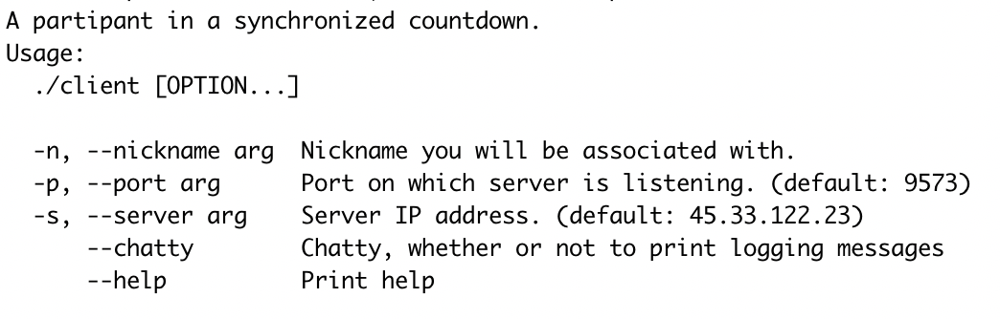
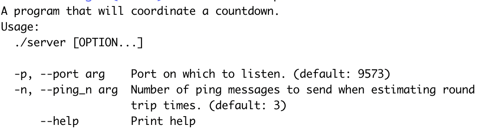

# Network Countdown

Awhile ago I found myself watching a movie over a video chat with my (at the moment) long-distance girlfriend. To synchronize the movie, we had to use our voices to do a countdown. It felt a little silly and imprecise to do a countdown with our voices in this way. To let computers do the work, I wrote this program.

## Usage

Running network countdown involves a server which coordinates things, and each participant in the countdown is a client who communicates only with the server. Clients can initiate countdowns, among other things with a command line interface. The server enforces various parts of the network countdown protocol, relays messages among clients, and initiates test messages which estimate round-trip-times and to make the synchronization fine-grained when significant differences in latency exist.

Executables are provided in the `build` directory with names indicating the platform they can run on. You can run executables in the build directory, you can copy the relevant client and server executables to `./client` and `./server` (the standard names for the client and server programs in this documentation), or you can compile the client and server yourself. Compiling should be as simple as `make all`, and you can refer to the Makefile for more details if needed.

### Running the Client

`./client --help`
This will display a relevant help message. Here is a copy of that help:

### Client Interface

`countdown <n>` : will initiate a `<n>` second countdown. If `<n>` is not specified, it is a three second countdown.
`write <x>` : will make every client's computer say `<x>` with text-to-speech.
`q|quit|exit` : entering any of these will disconnect from the server.

### Running the Server

`./server --help`
This will display a relevant help message. Here is a copy of that help:

## Dependencies

Doing the countdown over the speakers requires text-to-voice command-line software. If you are using a mac, the `say` command is built in and you don't need to install anything. If you are using an ubuntu-style linux distribution, the `gnustep-gui-runtime` package provides a `say` command . Other platforms have not been considered so far, but if you would like to use this with a different platform send me an email at seewalker.120@gmail.com and I will work something out. The test suite has a "Dependencies" section which will test whether the dependencies are met.

Windows is not supported at the moment.

## Plans

- Use openssl for privacy, done with an ifdef in case SSL libraries are not supported.
- Make unit tests which enact the whole protocol.
